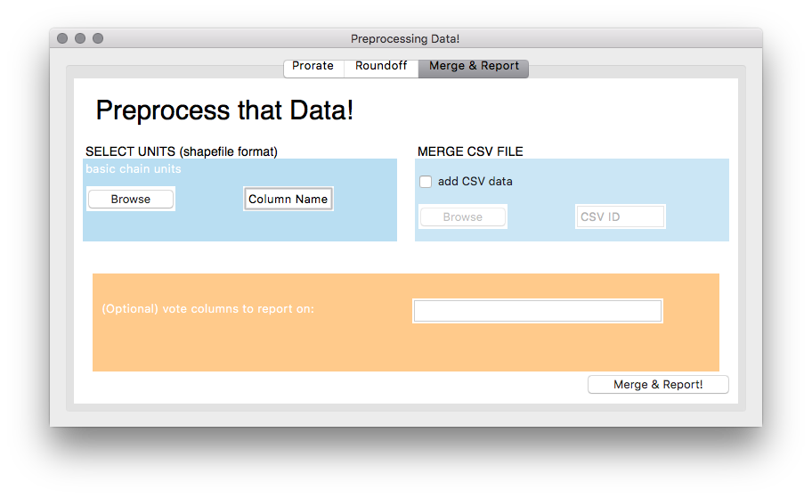
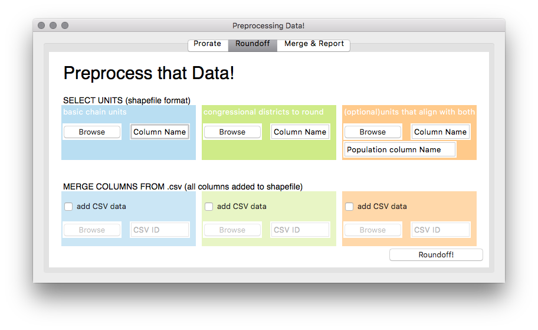
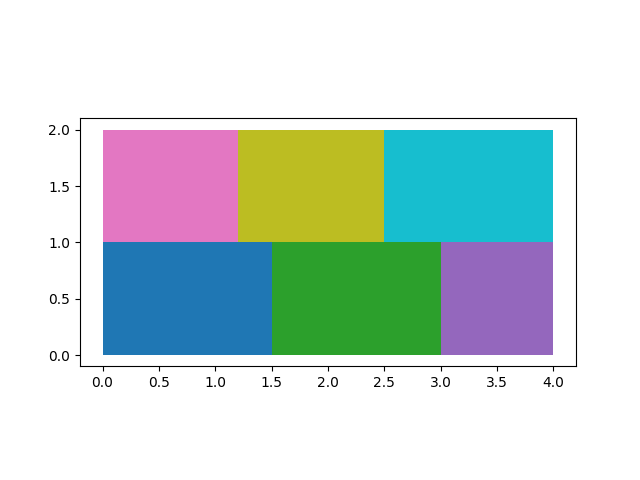
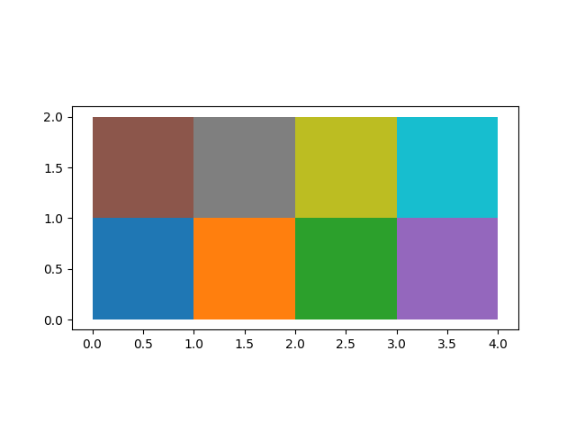
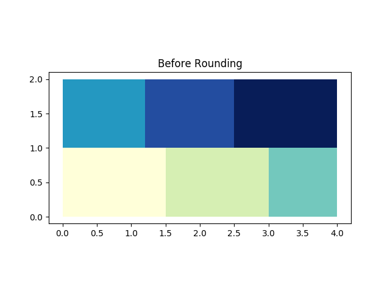
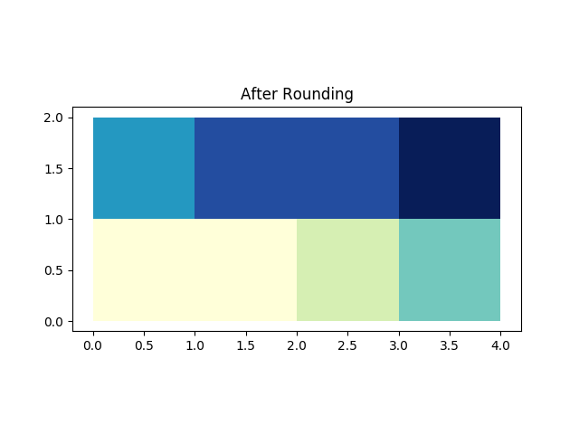
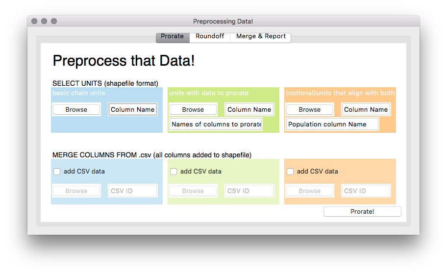
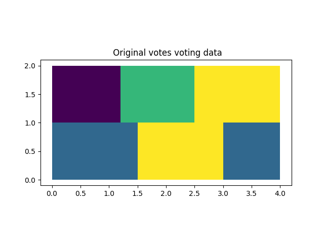
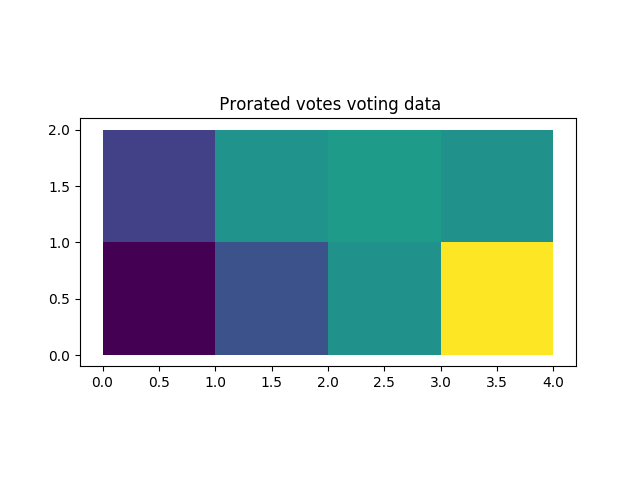

=========================
Preprocessing Shapefiles!
=========================

This code is for manipulating data stored in multiple 
shapefiles and csv format files to make them amenable to the 
RunDMCMC project. 
Currently supported functionality includes: 

    + Generating a quick report on shapefiles including column data and stats 
      on the underlying geographic units

    + Proration: the process of applying voting/demographic data from one 
      set of geographic units (e.g. counties) to another (e.g. precincts). 
      This is done proportionally to either the area of overlap, or the 
      population in the overlap between geographic units. 

    + Roundoff: When a districting plan does not respect precinct/county lines, 
      this process wiggles the boundaries of the districts until they do align. 

Merging csv data, collecting column information, and reporting
==============================================================

This tab allows for an easy get-to-know your data option. 

    - To merge data from a csv, check the **merge csv data** button, 
      add the file, and specify the column name. 
      This will perform a SQL-style join on the original shapefile and the csv data file. 
      It matches each entry in the shapefile with a row in the csv by 
      matching the **Column Name** from the shapefile and the **CSV ID** 
      specified for the csv. 

    - To generate a report that has the names of the columns in the shapefile, 
      a plot of the file itself, and summary statistics on the geometry of the 
      geographic units involved, click the **Merge & Report** button

    - For a report that has more in-depth data about specific columns in the 
      shapefile, type the names of those columns, comma separated, in the orange box.

To view the report, open the file titled **Report_on_<FILE>.html** where **<FILE>** 
is the name of the original shapefile

Roundoff: merging congressional district Data from one shapefile to another
===========================================================================

When 2 maps align, but the lines drawn on them don't, it can be useful to 
*round* the units of one into the other. 

This process creates 2 files: a report and a shapefile, 
both located in the Preprocessing/ folder. 
These files are called Roundoff.html and Rounded.shp respectively. 

The shapefile is based on the geographic units and data 
in the **basic chain units** shapefile, but with an added column: **CD**. 
This contains the value from the **Column Name** column in 
the **congressional districts to round** file that most closely 
corresponds to the units in **basic chain units**

The report contains data about the process of rounding off. Specifically, 
how many of the geographic units did not align well, and the general characteristics 
of the two shapefiles being used. 

Example
-------
In the **test_files/** folder, there are 2 useful shapefiles: 
biggestUnits.shp and basicUnits.shp

The biggestUnits.shp file covers all of basicUnits.shp, 
but the units do not overlap with the boundaries of basicUnits perfectly. 

+------------------+-----------------+
| biggestUnits.shp |  basicUnits.shp |
+==================+=================+
|      |big|       |     |basic|     |
+------------------+-----------------+

In order to get an association where each unit in 
basicUnits.shp is assigned to a unit in biggestUnits.shp, we 
launch the GUI and in the blue (basic chain units) field, 
navigate to the basicUnits.shp file. This file has a column 
called **ID** that gives a unique identifier for each unit in 
the file. Type ``ID`` into the ``Column Name`` field for basic chain units. 

Now use the biggestUnits.shp file in the green field with 
the unique identifier column **BID** and click ``Roundoff``

This generates the report and shapefile! 

+-----------------+------------------+
|  biggest Units  |   biggest Units  |
| Before Rounding | Rounded to Basic |
+=================+==================+
|      |rbig|     |      |rbsc|      |
+-----------------+------------------+

Prorating Data from one shapefile to another
============================================

To prorate data from one shapefile to another, you need 
the two shapefiles as well as the names of the columns that 
have data to be copied from one to the other, and a column 
name for each shapefile that will uniquely identify each element 
so that the assigning of vote values to each element is well-defined. 

The process returns a new shapefile based on the original 
**basic chain units** shapefile with added vote data that has been 
assigned proportionally by area of overlap from the 
file specified in **units with data to prorate**. It also creates 
a report that tallies the prorated data in each shapefile to make sure 
that no data was lost, and generates graphics of the results. 

Example
-------
As in the previous example, we will use the two files 
biggestUnits.shp and basicUnits.shp, in the **test_files/** folder. 

Note that biggestUnits.shp has a column called **votes** that 
stores some vote data for a made-up election. This vote data needs 
to be assigned to the basicUnits.shp units proportionally. 

As before, for the blue **basic chain units** field, 
use the browse button to choose basicUnits.shp, and 
use **ID** as the Column Name for a unique ID to add data to. 

Now use the biggestUnits.shp file in the green field with 
the unique identifier column **BID**. The vote data we want to 
add is stored in the column **votes**, so type **votes** in the 
field ``Names of columns to prorate`` and click ``Prorate``

This generates the report and shapefile! 

+-----------------+-------------------+
|  biggest Units  |    basic Units    |
| with vote data  | with rounded data |
+=================+===================+
|      |pbig|     |      |pbsc|       |
+-----------------+-------------------+

Merging on extra data
^^^^^^^^^^^^^^^^^^^^^
Note that sometimes the data to prorate does not 
actually live on the shapefile itself, but is in a separate 
csv file. In this test case, there is additional vote 
data in the file **test_files/biggerUnitsData.csv**. 

We will merge the csv into the biggestUnits.shp file and 
prorate directly onto basicUnits by checking the ``add CSV data`` 
button in the green field and navigating to that file. 

To merge, we need a column in the csv that will match 
the ID column for biggestUnits.shp. In this case, the 
name of the matching column is **IDCOL**. Add this to 
the ``CSV ID`` field and then add the names of the 
columns to prorate from this file to the list in the 
field ``Names of columns to prorate``, and click ``Prorate``!

Launching the GUI
=================

To use this code for any of the above options, open a terminal, 
navigate to the Preprocessing folder in terminal, and type 

.. code-block:: python

    python main.py

This launches an interactive prompt with 3 tabs, one for 
each of the proeccesses that can be done. 

.. NOTE:: this code produces reports for each process, as well as 
    new shapefiles with added data if either proration or roundoff is used. 
    These are automatically stored in the **Preprocessing/** directory. 

Getting the code & dependencies
===============================

This code does not require any special installation to use. However, 
it does use geopandas, pandas, matplotlib, tkInter, and numpy. Prior to 
downloading and attempting to run, all of these libaries will need to be 
installed. After this, clone/download the repository to an easily accessible
location, and start running!

Note: population weight vs area weight
======================================

In all of the notes above, the prorating and rounding were done 
based on the area of overlap between the biggestUnits and basicUnits. 
For certain cases, this is not perhaps the best way to assign boundaries. 
For example, when allocating votes, it can be helpful to consider the 
underlying distribution of population within the areas of overlap 
between basicUnits and biggestUnits and assign proportionally to the 
*population in the overlap* rather than the *area of the overlap*. 
To do this, we need a 3rd shapefile that has smaller units in common with 
both basicUnits and biggestUnits, that has population as well. 
This is what the orange field in both the proration and roundoff tabs are for. 
For more information on how to do population weighted proration and roundoff, 
see the documentation. 

